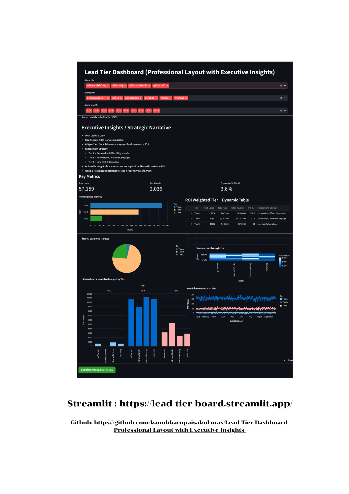

# Lead Tier Dashboard

A professional **Lead Tier Dashboard** built with **Python** and **Streamlit** to provide actionable insights for lead scoring and ROI evaluation.

## Description
Dashboard นี้ใช้สำหรับจัด Tier ลูกค้าและวิเคราะห์ ROI ของ Leads โดยมีฟีเจอร์:
- คำนวณคะแนนตามอายุรถ, อาชีพ, ภูมิภาค และเครดิตบูโร
- จัด Tier อัตโนมัติ (Tier A / B / C)
- แสดง Dashboard แบบมืออาชีพพร้อม Insights สำหรับ Executive

---

## How to Run
ติดตั้ง dependencies ก่อน:
```bash
pip install -r requirements.txt

---

## 🚀 Features
- Interactive lead scoring & tier classification
- Executive-ready layout with charts and tables
- Ready for deployment on Streamlit Cloud

---

## 📸 Screenshot



---

## ⚡ Live Demo
Try it here: [Streamlit Link](https://lead-tier-dashboard.streamlit.app)

---

## 💻 Quick Run
```bash
pip install streamlit pandas plotly numpy
streamlit run lead_dashboard26.final.py
